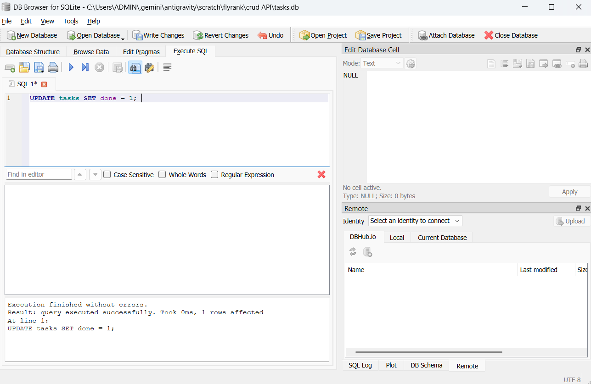

# Task API

A simple REST API built using **Node.js**, **Express.js**, and **SQLite** for managing tasks.

The API supports full CRUD operations:

* **Create** new tasks
* **Read** tasks
* **Update** existing tasks
* **Delete** tasks

The project uses **SQLite** as a persistent database and **Swagger UI** for interactive API documentation.

---

# Installation and Running

## 1. Install dependencies

Run:

```bash
npm install
```

This installs all required packages, including:

* Express.js
* Swagger UI Express
* better-sqlite3

## 2. Start the server

Run:

```bash
npm start
```

The server will start on:

```text
http://localhost:3000
```

Swagger documentation is available at:

```text
http://localhost:3000/docs
```

---

# Why SQLite?

SQLite was chosen for this project because it provides a simple way to store data without requiring a separate database server.

The main benefits are:

* **Single file** — the entire database is stored in one `tasks.db` file.
* **Zero setup** — no separate database server or configuration is required.
* **Survives restarts** — tasks remain stored after the Node.js server is stopped and started again.
* **Simple and lightweight** — it is well suited for this small REST API.

---

# Database

The database file is:

```text
tasks.db
```

It is created automatically by the application when the server starts:

```javascript
const db = new Database("tasks.db");
```

If the file does not exist, SQLite creates it automatically.

The application also automatically creates the `tasks` table:

```sql
CREATE TABLE IF NOT EXISTS tasks (
    id INTEGER PRIMARY KEY,
    title TEXT,
    done Boolean
)
```

The table contains:

| Column  | Type    | Description                                   |
| ------- | ------- | --------------------------------------------- |
| `id`    | INTEGER | Primary key, automatically assigned by SQLite |
| `title` | TEXT    | Task title                                    |
| `done`  | Boolean | Stored as `0` or `1`                          |

The application seeds three example tasks only when the table is empty.

The `tasks.db` file is normally **git-ignored**, so each clone of the repository starts with a fresh database. When a new user starts the application, the database file, table, and three example tasks are created automatically.

---

# API Endpoints

| Method | Endpoint     | Description               |
| ------ | ------------ | ------------------------- |
| GET    | `/tasks`     | Get all tasks             |
| GET    | `/tasks/:id` | Get a specific task by ID |
| POST   | `/tasks`     | Create a new task         |
| PUT    | `/tasks/:id` | Update an existing task   |
| DELETE | `/tasks/:id` | Delete a task             |
| GET    | `/health`    | Check API health          |

---

# Task Object Structure

A task returned by the API looks like:

```json
{
  "id": 1,
  "title": "Task 1",
  "done": 1
}
```

SQLite stores boolean values as:

```text
1 = true / completed
0 = false / not completed
```

---

# API Examples

## 1. Get All Tasks

Request:

```bash
curl -i http://localhost:3000/tasks
```

Example response:

```http
HTTP/1.1 200 OK
Content-Type: application/json
```

```json
[
  {
    "id": 1,
    "title": "Task 1",
    "done": 1
  },
  {
    "id": 2,
    "title": "Task 2",
    "done": 0
  },
  {
    "id": 3,
    "title": "Task 3",
    "done": 0
  }
]
```

---

## 2. Get a Task by ID

Request:

```bash
curl -i http://localhost:3000/tasks/1
```

Example response:

```http
HTTP/1.1 200 OK
Content-Type: application/json
```

```json
{
  "id": 1,
  "title": "Task 1",
  "done": 1
}
```

If the task does not exist, the API returns:

```http
HTTP/1.1 404 Not Found
```

---

## 3. Create a New Task

Request:

```bash
curl -i -X POST http://localhost:3000/tasks \
-H "Content-Type: application/json" \
-d '{"title":"Buy milk"}'
```

Example response:

```http
HTTP/1.1 201 Created
Content-Type: application/json
```

```json
{
  "id": 4,
  "title": "Buy milk",
  "done": 0
}
```

The ID is assigned automatically by SQLite.

---

## 4. Update a Task

Request:

```bash
curl -i -X PUT http://localhost:3000/tasks/2 \
-H "Content-Type: application/json" \
-d '{"title":"Study Node.js","done":true}'
```

Example response:

```http
HTTP/1.1 200 OK
Content-Type: application/json
```

```json
{
  "id": 2,
  "title": "Study Node.js",
  "done": 1
}
```

---

## 5. Delete a Task

Request:

```bash
curl -i -X DELETE http://localhost:3000/tasks/2
```

Successful response:

```http
HTTP/1.1 204 No Content
```

The response has an empty body.

---

## 6. Health Check

Request:

```bash
curl -i http://localhost:3000/health
```

Response:

```json
{
  "status": "ok"
}
```

---

# SQL Query Example

During Stage 4, the database was opened using **DB Browser for SQLite** and SQL queries were executed directly.

One example query was:

```sql
SELECT * FROM tasks WHERE done = 1;
```

This query returns only completed tasks.

For example, if the database contains:

| id | title  | done |
| -: | ------ | ---: |
|  1 | Task 1 |    1 |
|  2 | Task 2 |    0 |
|  3 | Task 3 |    1 |

the query returns:

| id | title  | done |
| -: | ------ | ---: |
|  1 | Task 1 |    1 |
|  3 | Task 3 |    1 |

Changes made directly in DB Browser for SQLite are reflected by the API because both the API and DB Browser use the same `tasks.db` file.

---

# Database Screenshot

The SQLite database was opened using **DB Browser for SQLite**.

Add your screenshot to the project and name it:

```text
DB.png
```

Then the screenshot can be displayed here:



---

# Swagger UI Documentation

Swagger UI provides interactive documentation for the API.

It allows the API endpoints to be tested directly from the browser using the **Try it out** button.

Open:

```text
http://localhost:3000/docs
```


---

# Project Structure

```text
crud API/
│
├── server.js                  # Express server and API routes
├── openapi.json               # Swagger/OpenAPI documentation
├── README.md                  # Project documentation
├── database-screenshot.png    # DB Browser screenshot
├── swagger-screenshot.png     # Swagger UI screenshot
├── .gitignore                 # Git ignored files
├── package.json
└── package-lock.json
```

The `tasks.db` file is intentionally not included in the repository because it is created automatically when the application starts.

---

# Automatic Database Setup

No manual database setup is required.

After cloning the repository, run:

```bash
npm install
```

Then start the application:

```bash
npm start
```

The application automatically:

1. Creates `tasks.db` if it does not exist.
2. Creates the `tasks` table.
3. Checks whether the table is empty.
4. Inserts three example tasks if the table is empty.

A clean installation therefore starts with three example tasks.

---

# Technologies Used

* Node.js
* Express.js
* SQLite
* better-sqlite3
* Swagger UI Express
* OpenAPI 3.0
