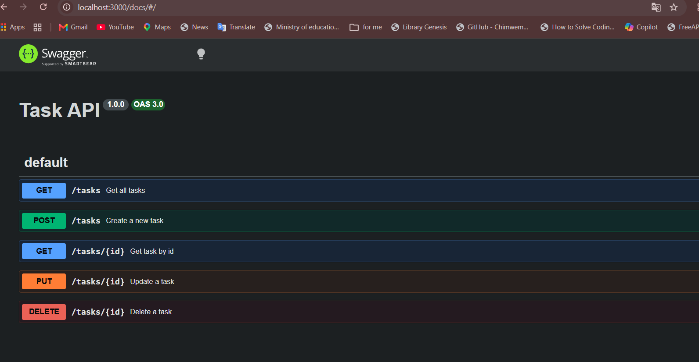

# Task API

A simple REST API built using **Node.js**, **Express.js**, and **PostgreSQL** for managing tasks.

The API supports full CRUD operations:

* **Create** new tasks
* **Read** tasks
* **Update** existing tasks
* **Delete** tasks

The application uses **PostgreSQL** as its database and **Docker Compose** to run the API and database together.

The entire application stack can be started with one command:

```bash
docker compose up
```

Swagger UI is also included for interactive API documentation.

---

# Installation and Running

## 1. Clone the repository

Clone the repository and enter the project directory:

```bash
git clone <https://github.com/khaledAlnouby/crud-API.git>
cd crud-api
```

## 2. Install dependencies

If you are running the application directly on your machine, dependencies can be installed with:

```bash
npm install
```

However, when using Docker Compose, the dependencies are installed inside the API Docker image automatically.

## 3. Create the environment file

The project includes a `.env.example` file containing the required environment variable.

Copy it to `.env`.

On Windows PowerShell:

```powershell
Copy-Item .env.example .env
```

The `.env` file contains:

```env
DATABASE_URL=postgres://postgres:dev@db:5432/tasks
```

The `.env.example` file is committed to the repository so that another developer knows which environment variables are required.

## 4. Start the entire application

Make sure Docker Desktop is running, then run:

```bash
docker compose up
```

This single command starts:

* The Node.js API
* The PostgreSQL database
* The Docker network connecting the API and database
* The persistent PostgreSQL volume

The server will be available at:

```text
http://localhost:3000
```

Swagger documentation is available at:

```text
http://localhost:3000/docs
```

To stop the application, press:

```text
Ctrl + C
```

---

# Why Docker Compose?

Docker Compose allows the API and PostgreSQL database to run together as one application stack.

Instead of starting PostgreSQL and the API separately, one command starts everything:

```bash
docker compose up
```

The project contains two services:

```text
api
 │
 │ Docker Compose network
 │
 ▼
db
 │
 ▼
PostgreSQL
```

The API connects to PostgreSQL using the service name:

```text
db
```

Therefore, inside Docker the database connection uses:

```env
DATABASE_URL=postgres://postgres:YOUR_PASSWORD@db:5432/tasks
```

`db` is used instead of `localhost` because the API and PostgreSQL are running in separate Docker containers.

---

# Environment Variables

The application requires the following environment variable:

```env
DATABASE_URL=postgres://postgres:dev@db:5432/tasks
```

This variable is stored locally in:

```text
.env
```

The project also contains:

```text
.env.example
```

with the same variable and example values.

The actual `.env` file is ignored by Git.

The `.gitignore` file contains:

```gitignore
node_modules/
.env
```

This prevents environment configuration from being accidentally committed to the repository.

---

# PostgreSQL Database

PostgreSQL runs as a separate Docker Compose service.

The database configuration is:

```text
Database: tasks
User: postgres
Password: dev
Port: 5432
Docker service name: db
```

The PostgreSQL database is created automatically by Docker Compose.

The application automatically creates the `tasks` table when it starts:

```sql
CREATE TABLE IF NOT EXISTS tasks (
    id SERIAL PRIMARY KEY,
    title TEXT NOT NULL,
    done BOOLEAN NOT NULL DEFAULT FALSE
);
```

The application also checks whether the table is empty.

If the table is empty, three example tasks are inserted:

```text
Task 1
Task 2
Task 3
```

The seed operation only runs when the table is empty, so restarting the application does not create duplicate tasks.

---

# Docker Volume

The PostgreSQL database uses a named Docker volume:

```text
taskdata
```

The volume provides persistent database storage.

This means database data survives when the containers are stopped and started again.

For example:

```bash
docker compose down
```

followed by:

```bash
docker compose up
```

does not delete the PostgreSQL data.

The tasks previously created in the database will still exist.

---

# API Endpoints

| Method | Endpoint     | Description               |
| ------ | ------------ | ------------------------- |
| GET    | `/tasks`     | Get all tasks             |
| GET    | `/tasks/:id` | Get a specific task by ID |
| POST   | `/tasks`     | Create a new task         |
| PUT    | `/tasks/:id` | Update an existing task   |
| DELETE | `/tasks/:id` | Delete a task             |
| GET    | `/health`    | Check API health          |

---

# Task Object Structure

A task has the following structure:

```json
{
  "id": 1,
  "title": "Learn Express.js",
  "done": false
}
```

The `done` field is a PostgreSQL Boolean:

```text
true  = completed
false = not completed
```

---

# API Examples

## 1. Get All Tasks

Request:

```bash
curl -i http://localhost:3000/tasks
```

Example response:

```http
HTTP/1.1 200 OK
Content-Type: application/json
```

```json
[
  {
    "id": 1,
    "title": "Task 1",
    "done": false
  },
  {
    "id": 2,
    "title": "Task 2",
    "done": false
  },
  {
    "id": 3,
    "title": "Task 3",
    "done": false
  }
]
```

---

## 2. Get a Task by ID

Request:

```bash
curl -i http://localhost:3000/tasks/1
```

Example response:

```http
HTTP/1.1 200 OK
Content-Type: application/json
```

```json
{
  "id": 1,
  "title": "Task 1",
  "done": false
}
```

If the task does not exist, the API returns:

```http
HTTP/1.1 404 Not Found
```

```json
{
  "error": "Task not found"
}
```

---

## 3. Create a New Task

Request:

```bash
curl -i -X POST http://localhost:3000/tasks \
-H "Content-Type: application/json" \
-d '{"title":"Buy milk"}'
```

Example response:

```http
HTTP/1.1 201 Created
Content-Type: application/json
```

```json
{
  "id": 4,
  "title": "Buy milk",
  "done": false
}
```

The ID is assigned automatically by PostgreSQL.

---

## 4. Update a Task

Request:

```bash
curl -i -X PUT http://localhost:3000/tasks/2 \
-H "Content-Type: application/json" \
-d '{"title":"Study Node.js","done":true}'
```

Example response:

```http
HTTP/1.1 200 OK
Content-Type: application/json
```

```json
{
  "id": 2,
  "title": "Study Node.js",
  "done": true
}
```

---

## 5. Delete a Task

Request:

```bash
curl -i -X DELETE http://localhost:3000/tasks/2
```

Successful response:

```http
HTTP/1.1 204 No Content
```

The response has an empty body.

If the task does not exist, the API returns:

```http
HTTP/1.1 404 Not Found
```

---

## 6. Health Check

Request:

```bash
curl -i http://localhost:3000/health
```

Response:

```json
{
  "status": "ok"
}
```

---

# PostgreSQL Command-Line Access

PostgreSQL can be opened directly from the running Docker Compose database service using:

```bash
docker compose exec db psql -U postgres -d tasks
```

Once connected, the PostgreSQL prompt appears:

```text
tasks=#
```

To list all database tables:

```sql
\dt
```

The `tasks` table should be displayed.

To view all tasks:

```sql
SELECT * FROM tasks;
```

Example:

```text
 id | title  | done
----+--------+------
  1 | Task 1 | f
  2 | Task 2 | f
  3 | Task 3 | f
```

To exit PostgreSQL:

```sql
\q
```

---

# Database Screenshot

The PostgreSQL database was inspected using the `psql` command-line tool.

The screenshot shows the database tables and the stored task records.

Add the screenshot to the project and name it:

```text
database-screenshot.png
```

Then display it here:


---

# Swagger UI Documentation

Swagger UI provides interactive documentation for the API.

It allows the API endpoints to be tested directly from the browser using the **Try it out** button.

Open:

```text
http://localhost:3000/docs
```



---

# Project Structure

```text
crud API/
│
├── server.js
├── db.js
├── openapi.json
├── Dockerfile
├── compose.yaml
├── .env.example
├── README.md
├── swagger-screenshot.png
├── database-screenshot.png
├── .gitignore
├── package.json
└── package-lock.json
```

The `.env` file is intentionally not included in the repository because it is ignored by Git.

The `.env.example` file is included so that a new developer knows which environment variables are required.

---

# Docker Setup

The complete application stack is managed by Docker Compose.

The main command is:

```bash
docker compose up
```

To run the containers in the background:

```bash
docker compose up -d
```

To check the running containers:

```bash
docker compose ps
```

To stop and remove the containers:

```bash
docker compose down
```

The database volume is not removed by `docker compose down`, so PostgreSQL data remains persistent.

---

# Clean Clone Verification

A new developer should be able to clone the repository and run the complete application without manually creating the PostgreSQL database or tables.

The workflow is:

### 1. Clone the repository

```bash
git clone <repository-url>
cd crud-api
```

### 2. Create `.env`

On Windows PowerShell:

```powershell
Copy-Item .env.example .env
```

### 3. Start the complete stack

```bash
docker compose up
```

### 4. Test the API

Run:

```bash
curl -i http://localhost:3000/tasks
```

The API should return:

```http
HTTP/1.1 200 OK
```

with the three seeded tasks.

No manual PostgreSQL setup is required.

---

# Persistence Verification

The database persistence can be verified by creating a task, stopping the stack, and starting it again.

### 1. Start the stack

```bash
docker compose up
```

### 2. Create a task

```bash
curl -i -X POST http://localhost:3000/tasks \
-H "Content-Type: application/json" \
-d '{"title":"Persistence test"}'
```

### 3. Stop the stack

```bash
docker compose down
```

### 4. Start the stack again

```bash
docker compose up
```

### 5. Check the tasks

```bash
curl -i http://localhost:3000/tasks
```

The previously created task should still exist because PostgreSQL data is stored in the persistent Docker volume.

---

# Technologies Used

* Node.js
* Express.js
* PostgreSQL
* Docker
* Docker Compose
* `pg`
* Swagger UI Express
* OpenAPI 3.0

---

# Stage 5 Checkpoint

Stage 5 completes the one-command stack and documentation requirements.

The project now provides:

* PostgreSQL running in Docker
* Node.js API running in Docker
* Docker Compose managing the API and database
* `.env` for local configuration
* `.env.example` for required environment variables
* `.env` excluded from Git
* Persistent PostgreSQL storage using a Docker volume
* Automatic database table creation
* Automatic seeding of three tasks when the table is empty
* Swagger UI documentation
* PostgreSQL database screenshot
* Complete API endpoint documentation

The entire stack can be started with:

```bash
docker compose up
```

A clean clone should work by copying `.env.example` to `.env` and running the command above, with no manual database setup required.
